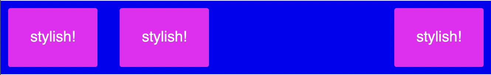

# HtmlUi

This a attempt to port the magic of [elm-ui](https://package.elm-lang.org/packages/mdgriffith/elm-ui/latest/), which my only [css escape plan](https://korban.net/elm/elm-ui-guide/). I love building app and ux but doing ui with html/css is a pain to me.


I want to be able to describe in a simple way my UI and use is like any other website. There is a lot of other proprietary approche like [Qt with qml](https://doc.qt.io/qt-5/qtqml-syntax-basics.html) or [Java with JavaFX](https://github.com/gluonhq/scenebuilder/wiki/Basic-JavaFX-project-with-Scene-Builder) but those are heavy and closed to there plateform.

I want something free from those constraint and web compliant.


Let's see where this route lead.


## Ideal Target

We want to be able to write something like this :

```xml
<layout>
    <row width="fill" centerY spacing="30" padding="30" bg-color="rgb(0,0,245)">
        <el bg-color="rgb(240,0,245)" font-color="rgb(255,255,255)" border-rounded="3" padding="30">
            stylish!
        </el>
        <el bg-color="rgb(240,0,245)" font-color="rgb(255,255,255)" border-rounded="3" padding="30">
            stylish!
        </el>
        <el alignRight>
            <el bg-color="rgb(240,0,245)" font-color="rgb(255,255,255)" border-rounded="3" padding="30">
                stylish!
            </el>
        </el>
    </row>
</layout>
```

and got this




for now I am using this [app](https://ellie-app.com/7Cw4VCyr3RGa1) to 
